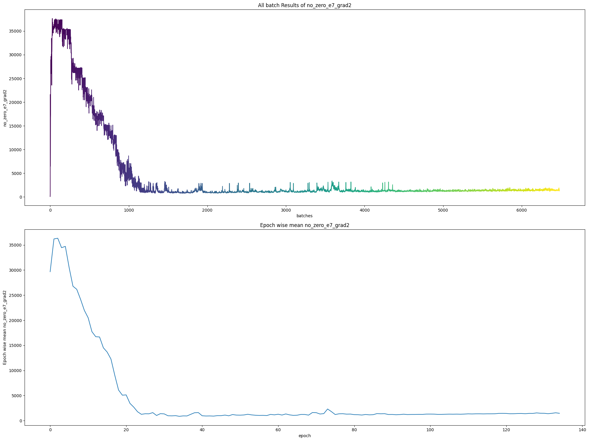
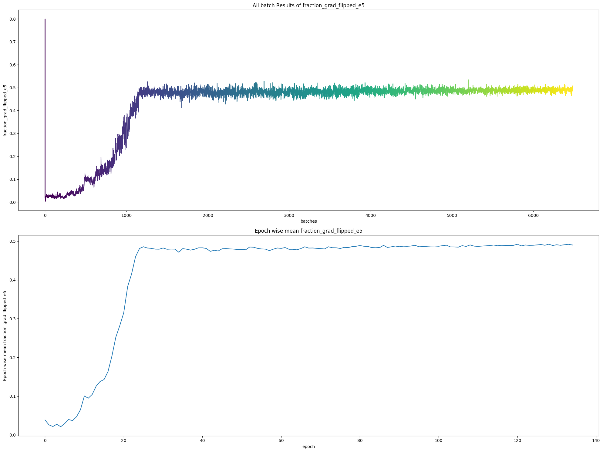
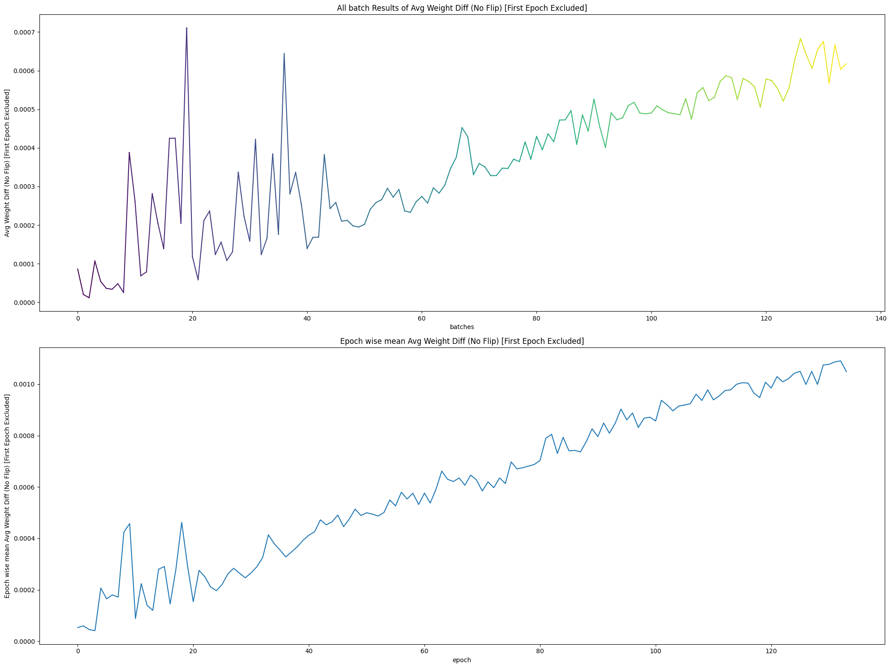

# Neural Network Visualization and Analysis Tools

This repository provides a collection of tools and experiments to visualize and understand the inner workings of neural networks. It focuses on two key areas: analyzing feature signals as they propagate through the network and gaining insights into the nitty-gritty of optimization steps during training.

---

## Feature Signal Visualization and Analysis

This project aims to understand the internal workings of a neural network by visualizing and analyzing the "signals" or feature activations as they propagate through the layers. The primary focus is on understanding how feature representations are correlated within and between layers and how these correlations evolve during the training process.

### Core Concepts

The main idea is to treat the activations of each layer as a feature representation of the input data. By analyzing these representations, we can gain insights into what the model is learning.

This project explores two main types of analysis:

1.  **Layer-wise Cross-Correlation**: We compute the cross-correlation between the flattened outputs of every pair of layers in the network. This results in a matrix of correlation matrices, which helps us understand:
    *   How similar the representations are between different layers.
    *   How information is transformed from one layer to the next.
    *   Whether certain layers are redundant or serve distinct purposes.

2.  **Evolution of Correlations over Training**: The layer-wise correlations are computed at different points during training (e.g., at the beginning of each epoch). This allows us to see how the network's internal representations change as it learns.

3.  **Augmentation-driven Feature Variance**: We analyze how different data augmentations applied to the same input image affect the feature representations within the network. This helps to understand the stability and invariance of the learned features.

### Implementation Details

The analysis is performed using a simple Multi-Layer Perceptron (MLP) trained on the MNIST dataset.

#### Key Components

*   **Dataset**: MNIST, loaded using `torchvision`.
*   **Model**: A 4-layer MLP with `BatchNorm`.
*   **Trainer**: A custom `Trainer` class that handles the training and validation loops.
*   **Callbacks**:
    *   `ModelSaveCallback`: Saves the model at regular intervals.
    *   `MetricsCallback`: Logs metrics (loss, accuracy, F1-score, etc.) to the console and TensorBoard.
*   **Analysis Functions**:
    *   `get_intermediate_outputs`: Extracts the activation outputs from each layer of the model.
    *   `compute_layerwise_cross_correlation`: Computes the correlation between layer activations.
    *   `plot_layerwise_correlations`: Visualizes the correlation matrices.
    *   `store_corr_means`: Persistently stores the mean of correlation matrices in a JSON file to track their evolution.

#### Workflow

1.  **Data Loading**: The MNIST dataset is loaded and transformed.
2.  **Model Training**: The MLP model is trained on the dataset. The `Trainer` class orchestrates this process.
3.  **Correlation Analysis during Training**: At the beginning of each epoch, a batch of data is used to perform the layer-wise correlation analysis.
4.  **Visualization and Logging**:
    *   The correlation matrices are plotted and saved as images.
    *   The mean of these correlation matrices is logged to a JSON file to track changes over epochs.
    *   Training metrics are logged to TensorBoard.
5.  **Augmentation Analysis**: After training, the script performs an analysis on how data augmentations affect the feature representations for a single sample.

### How to Run

The code is structured as a script (originally from a Jupyter Notebook). To run it, you would typically execute the cells in order. The main training process is initiated by calling the `fit` method of the `Trainer` object.

### Outputs

The script generates several outputs:

*   **Saved Models**: The trained model weights are saved periodically (`.pth` files).
*   **TensorBoard Logs**: Training and validation metrics are saved in a logs directory for visualization with TensorBoard.
*   **Correlation Plots**: Images of the layer-wise correlation matrices are saved for each analysis step.
*   **Correlation Data**: A JSON file (`corr_means.json`) is created to store the history of mean correlation values between layers across epochs.

### Visualizations

Here are some of the visualizations generated by the project:

*   **Layer Feature Correlation (`assets/feature-signal-vis/layer_feature_correlation.png`)**: This image displays a correlation map between features of different layers (from layer `i` to layer `j`, where `i <= j`). It helps visualize how feature representations are related across the network's depth.

    

*   **Augmented MNIST Samples (`assets/feature-signal-vis/augs/*.png`)**: These are sample images of an MNIST digit after applying a series of 300 different augmentations. This dataset is used to analyze feature stability.

    
    

*   **Intra-Layer Feature-Feature Correlation (`assets/feature-signal-vis/intra/l1_ff.png`, `assets/feature-signal-vis/intra/l4_ff.png`)**: These heatmaps show the neuron-to-neuron correlation within a single layer (e.g., the first and last layers). The dimensions are `feature x feature`, revealing internal feature dependencies.

    *   **First Layer (l1_ff.png)**: 
        
    *   **Last Layer (l4_ff.png)**: 
        

*   **Intra-Layer Sample-Sample Correlation (`assets/feature-signal-vis/intra/l1_bb.png`, `assets/feature-signal-vis/intra/l4_bb.png`)**: These heatmaps show how features from different augmented versions of the same image correlate with each other. The dimensions are `#samples x #samples`, measured with respect to a specific layer's features. This illustrates feature robustness to augmentations.

    *   **First Layer (l1_bb.png)**:
        
    *   **Last Layer (l4_bb.png)**:
        

---

## Optimization Insight

This project contains code to analyze the optimization process of a neural network. The primary goal is to gain insights into the behavior of gradients during training, with a special focus on the dynamics of "zero" or near-zero gradients.

### Methodology

The analysis is performed by training a simple Convolutional Neural Network (CNN) on the CIFAR-10 dataset. A custom Keras callback is used to monitor and record various metrics at each training step.

The key aspects of the analysis include:

- **Gradient and Weight Tracking**: The callback records the gradients and weights of the model at each batch. It also maintains a moving average of these values.
- **Zero-Gradient Dynamics**: It tracks the number of parameters with gradients close to zero. It analyzes how many of these "zero gradients" become non-zero in the next step ("released") and how many remain zero ("retained").
- **Weight Evolution**: The code investigates how the model's weights change for parameters that have zero gradients.
- **Gradient Sign Flips**: It counts the number of gradients that change their sign between updates.
- **Local Minima/Maxima Detection**: It attempts to identify whether a weight update corresponds to a local minimum or maximum based on the relationship between weight change and gradient change.
- **Logging and Visualization**: The collected data is saved in JSON files for detailed analysis. The process also integrates with TensorBoard for real-time visualization of the metrics.

### Structure

The refactored code is organized into the following modules:

-   `data_loader.py`: Contains functions for loading and preprocessing the CIFAR-10 dataset.
-   `model.py`: Defines the CNN architecture and the custom `CustomModel` class with the overridden `train_step`.
-   `callbacks.py`: Contains the `OptimizationInsightCallback` class for collecting and logging the optimization metrics.
-   `utils.py`: Includes various utility functions for calculations (e.g., gradient analysis, statistics) and saving/loading results.
-   `trainer.py`: The main script that orchestrates the training process, including setting up the model, data, and callbacks, and starting the training.
-   `config.py`: Contains configuration parameters for the training process, such as batch size, image dimensions, and paths.
-   `main.py`: The entry point for running the training and analysis.

### Visualizations

This section showcases the various plots generated to analyze the optimization dynamics.

*   **Epoch-wise Zero Gradients (`assets/optimization-insight/zero_e7_grads.png`)**: This plot shows the number of gradients with an absolute value less than `1e-7` at each epoch, indicating how many parameters are in a near-zero gradient state.

    

*   **Fraction of Released Gradients (`assets/optimization-insight/frac_zero_grads_released.png`)**: This plot displays the fraction of gradient components that were previously in a low-value state (`|g| < 1e-5`) but have since been "released" (i.e., their magnitude increased).

    

*   **Fraction of Sign Flips (`assets/optimization-insight/frac_flip.png`)**: This plot tracks the fraction of gradient components that change their sign around zero from one epoch to the next, providing insight into oscillations during optimization.

    

*   **Weight Difference Norm (`assets/optimization-insight/wdiff.png`)**: This plot shows the norm of the difference between weight vectors in consecutive batches, illustrating the magnitude of weight updates over time.

    

*   **Layer-wise Gradient Signs (`assets/optimization-insight/layer_wise_grad_signs.png`)**: This heatmap visualizes the signs of gradients across all layers over the course of training.
    *   **Y-axis**: Training epochs.
    *   **X-axis**: Gradient indices from the first to the last layer.
    *   **Colors**:
        *   White: `|gradient| > 1e-5`
        *   Red: `gradient < 0` (and `|gradient| <= 1e-5`)
        *   Green: `gradient > 0` (and `|gradient| <= 1e-5`)

    

*   **Zoomed Layer-wise Gradient Signs (`assets/optimization-insight/zoomed_layer_wise_grad_signs.png`)**: A zoomed-in version of the above plot, providing a more detailed view of the gradient sign dynamics in a specific region.

    

# Direction 1: Squeeze and Expansion (not Excitation) Network
## Ablation 0
   - Dataset: MNIST
   - Model: Input (32×32×3) → Flatten → 3072 → 1024 (Regular Perceptron) → 1024 → 32 → 512 (Squeeze–Expand) → 512 → 32 → 256 (Squeeze–Expand) → 256 → num_classes → Softmax
   - No data augmentation 
   - No regularization
   - Optimizer: Adam
### Model Architecture

### Weight Plots and Power Spectra
### Feature Plots and Power Spectra
These plots are in the path : `notebooks/squeeze_expand_network_v0.ipynb`.

## Ablation 1
   - Model: Input (32×32×3) → Flatten → 3072 → 1024 (Regular Perceptron) → 1024 → 8 → 512 (Squeeze–Expand) → 512 → 8 → 256 (Squeeze–Expand) → 256 → num_classes → Softmax
    - Other settings same as Ablation 0
### Model Architecture

### Weight Plots and Power Spectra
### Feature Plots and Power Spectra
These plots are in the path : `notebooks/squeeze_expand_network_v1.ipynb`.

## Ablation 2
   - Model: Input (32×32×3) → Flatten → 3072 → 1024 (Regular Perceptron) → 1024 → 2 → 512 (Squeeze–Expand) → 512 → 2 → 256 (Squeeze–Expand) → 256 → num_classes → Softmax
    - Other settings same as Ablation 0
### Model Architecture

### Weight Plots and Power Spectra
### Feature Plots and Power Spectra
These plots are in the path : `assets/squeeze-and-exp/f_svd_analysis_2.pdf` , `assets/squeeze-and-exp/w_svd_analysis_2.pdf`. and `notebooks/squeeze_expand_network_v2.ipynb`.
### Layerwise feature TSNE plots
These plots are in the path : `assets/squeeze-and-exp/model_tsne_layers_2.pdf`.

## Ablation 3
   - Model: Input (32×32×3) → Flatten → 3072 → 1024 (Regular Perceptron) → 1024 → 1 → 512 (Squeeze–Expand) → 512 → 1 → 256 (Squeeze–Expand) → 256 → num_classes → Softmax
    - Other settings same as Ablation 0
### Model Architecture

### Weight Plots and Power Spectra
### Feature Plots and Power Spectra
These plots are in the path : `assets/squeeze-and-exp/f_svd_analysis_3.pdf` , `assets/squeeze-and-exp/w_svd_analysis_3.pdf`. and `notebooks/squeeze_expand_network_v3.ipynb`.
### Layerwise feature TSNE plots
These plots are in the path : `assets/squeeze-and-exp/model_tsne_layers_3.pdf`.
