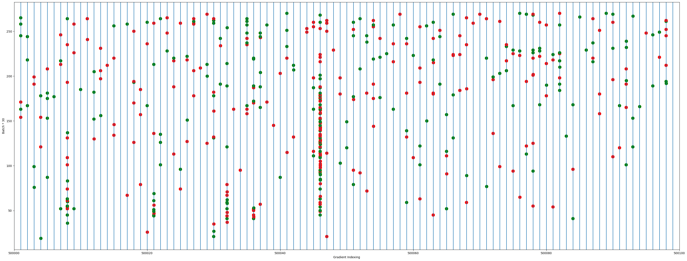

# Optimization Insight

This project contains code to analyze the optimization process of a neural network. The primary goal is to gain insights into the behavior of gradients during training, with a special focus on the dynamics of "zero" or near-zero gradients.

## Methodology

The analysis is performed by training a simple Convolutional Neural Network (CNN) on the CIFAR-10 dataset. A custom Keras callback is used to monitor and record various metrics at each training step.

The key aspects of the analysis include:

- **Gradient and Weight Tracking**: The callback records the gradients and weights of the model at each batch. It also maintains a moving average of these values.
- **Zero-Gradient Dynamics**: It tracks the number of parameters with gradients close to zero. It analyzes how many of these "zero gradients" become non-zero in the next step ("released") and how many remain zero ("retained").
- **Weight Evolution**: The code investigates how the model's weights change for parameters that have zero gradients.
- **Gradient Sign Flips**: It counts the number of gradients that change their sign between updates.
- **Local Minima/Maxima Detection**: It attempts to identify whether a weight update corresponds to a local minimum or maximum based on the relationship between weight change and gradient change.
- **Logging and Visualization**: The collected data is saved in JSON files for detailed analysis. The process also integrates with TensorBoard for real-time visualization of the metrics.

## Structure

The refactored code is organized into the following modules:

-   `data_loader.py`: Contains functions for loading and preprocessing the CIFAR-10 dataset.
-   `model.py`: Defines the CNN architecture and the custom `CustomModel` class with the overridden `train_step`.
-   `callbacks.py`: Contains the `OptimizationInsightCallback` class for collecting and logging the optimization metrics.
-   `utils.py`: Includes various utility functions for calculations (e.g., gradient analysis, statistics) and saving/loading results.
-   `trainer.py`: The main script that orchestrates the training process, including setting up the model, data, and callbacks, and starting the training.
-   `config.py`: Contains configuration parameters for the training process, such as batch size, image dimensions, and paths.
-   `main.py`: The entry point for running the training and analysis.

## Visualizations

This section showcases the various plots generated to analyze the optimization dynamics.

*   **Epoch-wise Zero Gradients (`assets/optimization-insight/zero_e7_grads.png`)**: This plot shows the number of gradients with an absolute value less than `1e-7` at each epoch, indicating how many parameters are in a near-zero gradient state.

    

*   **Fraction of Released Gradients (`assets/optimization-insight/frac_zero_grads_released.png`)**: This plot displays the fraction of gradient components that were previously in a low-value state (`|g| < 1e-5`) but have since been "released" (i.e., their magnitude increased).

    

*   **Fraction of Sign Flips (`assets/optimization-insight/frac_flip.png`)**: This plot tracks the fraction of gradient components that change their sign around zero from one epoch to the next, providing insight into oscillations during optimization.

    

*   **Weight Difference Norm (`assets/optimization-insight/wdiff.png`)**: This plot shows the norm of the difference between weight vectors in consecutive batches, illustrating the magnitude of weight updates over time.

    

*   **Layer-wise Gradient Signs (`assets/optimization-insight/layer_wise_grad_signs.png`)**: This heatmap visualizes the signs of gradients across all layers over the course of training.
    *   **Y-axis**: Training epochs.
    *   **X-axis**: Gradient indices from the first to the last layer.
    *   **Colors**:
        *   White: `|gradient| > 1e-5`
        *   Red: `gradient < 0` (and `|gradient| <= 1e-5`)
        *   Green: `gradient > 0` (and `|gradient| <= 1e-5`)

    

*   **Zoomed Layer-wise Gradient Signs (`assets/optimization-insight/zoomed_layer_wise_grad_signs.png`)**: A zoomed-in version of the above plot, providing a more detailed view of the gradient sign dynamics in a specific region.

    